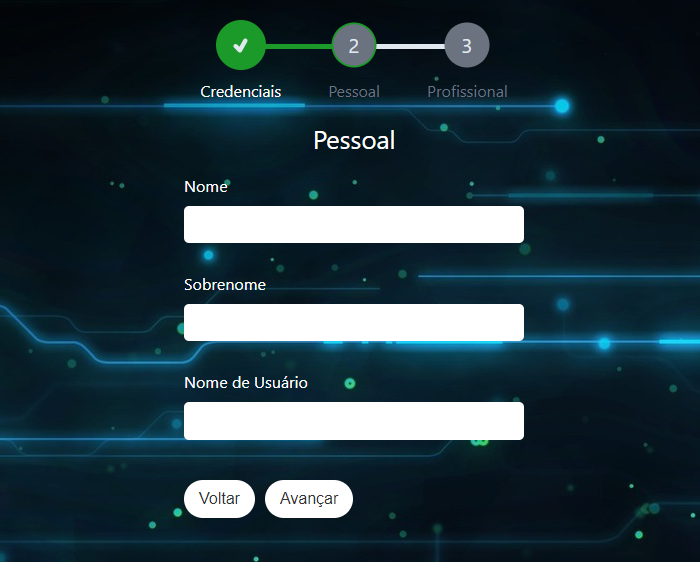

  

# MultistepForm

O MultistepForm é um formulário de várias etapas construído com typescript utilizando o Vite + React. No projeto o estado é centralizado usando a Context API, um recurso nativo do React, no qual foi organizado seguindo as melhores práticas do SOLID. Já a validação dos campos do formulário é realizada com Yup.

## Stack Utilizada:

- react v18
- react-icons v4.1
- yup v1.2
- styled-components v6.0
- typescript v5

## Principais Scripts

- npm run dev: Inicia modo de desenvolvimento.
- npm run build: Cria um aplicativo para produção\
  na pasta build.

---

  

